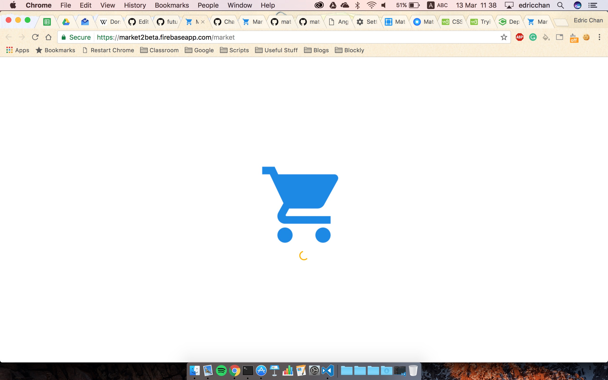
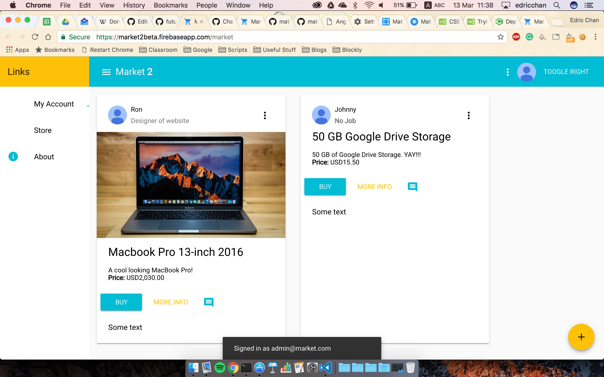
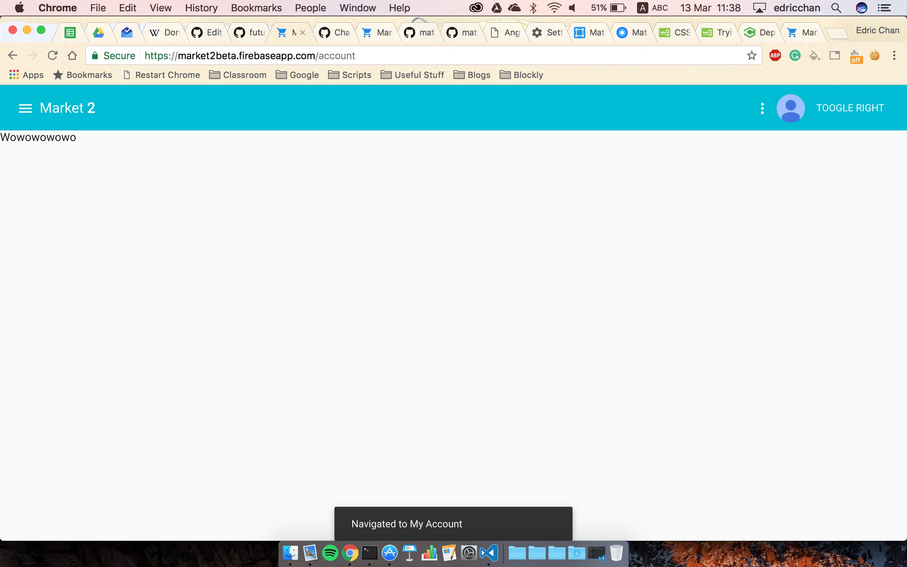
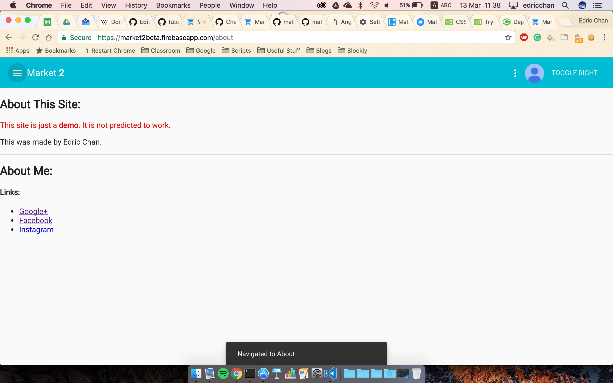
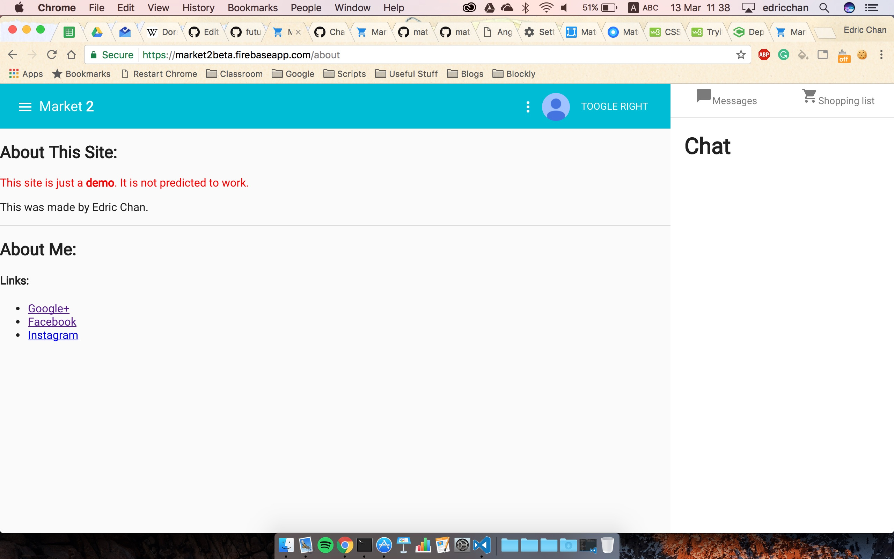
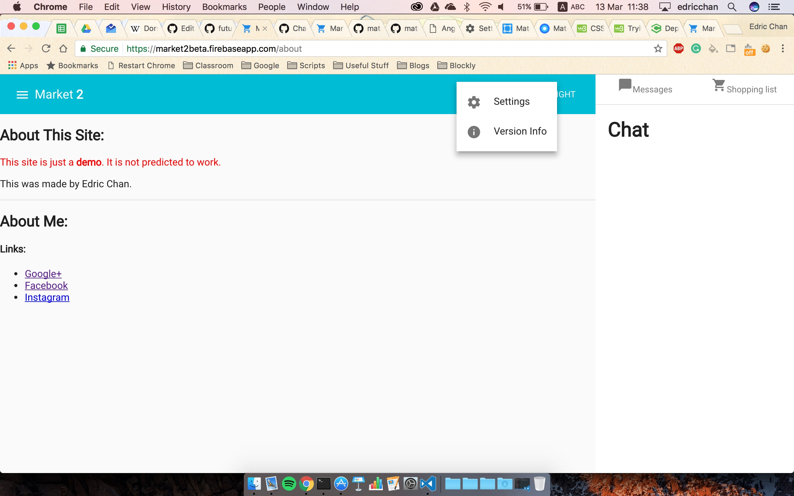

# market2
## Table of contents
- [About market2](#about-market2)
- [Current Status](#current-status)
- [Q & A](#q--a)
- [NOTES](#notes)
- [Screenshots](#screenshots)

---
### About market2
What's this repo all about, you may ask. Well, it's a test of [Angularfirebase2](https://github.com/angular/angularfirebase2), [Angular 2](https://github.com/angular/angular), [Angular Material 2](https://github.com/angular/material2), [Typescript](https://typescriptlang.org) and [Firebase](https://github.com/firebase) into one. <!--TODO: Make about longer-->

### Current Status
The website is currently in **BETA**.

### Q & A
**Q.** Where's the source code? I want it!!

**A.** ~~Unfortunately, I'm still working on it and it will come out as soon as possible.~~ **UPDATE**: The source code is available [here](https://github.com/Chan4077/market2).

**Q.** Where can I find the website?

**A.** The website is [here](https://market2beta.firebaseapp.com/), ~~although if you view it now, it will show an error as I have not deployed the code yet and am testing it on [@angular/cli](https://github.com/angular/angular-cli).~~  **UPDATE**: The website should be loading now as I have already done `firebase deploy`. You should not be able to see any problems or issues as of now, but if you see one, please open a [new issue](https://github.com/Chan4077/market2/issues/new).

**Q.** How on earth do you deploy Angular2 code?

**A.** Simple. Just use the [@angular/cli](https://github.com/angular/angular-cli). View the [wiki](https://github.com/angular/angular-cli/wiki) for more information about how to `init`, `build` and `serve`.

**Q.** Where can I find the docs for Angular2 ang AngularMaterial 2?

**A.** Here you go: [Angular2 Docs](https://angular.io) and [Angular Material 2 Docs](https://material.angular.io)

### NOTES
<!--TODO: Add notes-->

### Screenshots
Some screenshots:

- Starting up the website _(NOTE: I copied the CSS from Google Play Newsstand's startup page viewable on load [here](https://newsstand.google.com))_:

- A first look of the website _(Dat Mackbook Pro 2016 tho...)_:

- Heading to the account page... to find random letters! _(This was deliberate to test Angular's `Router` and this page will be updated soon)_:

- A disclaimer on the about screen... to find out that the website is just a DEMO!! _(Don't worry: that will be updated soon)_:

- Extra content on the right sidenav: Messages where you can communicate with friends on what to buy and a shopping list to help you from remembering what you bought! _(Yup, the icons seem misaligned: I will fix them soon.)_:

- And there's a menu! _(NOTE: The settings button will open a `Settings dialog` which will save to `localStorage` -> Just to be technical here. In human speak, it basically saves the settings for you!! :smile:)_:

For more screenshots, go [here](../img/market2)

:heart: Support me on Github!
